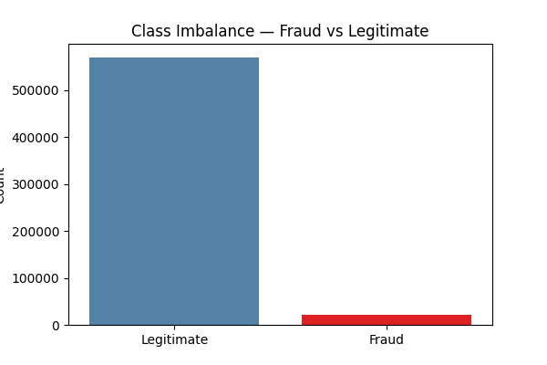
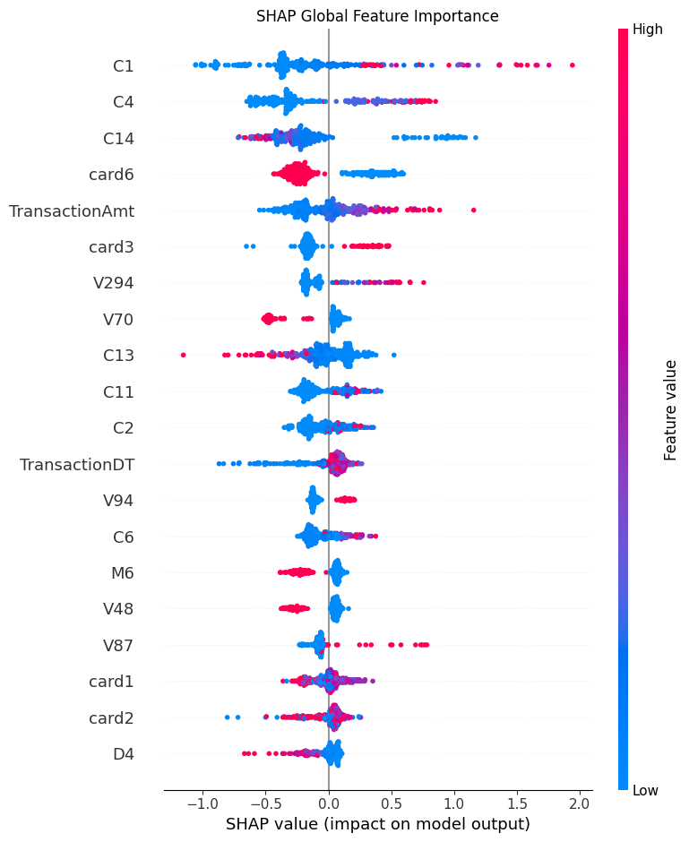
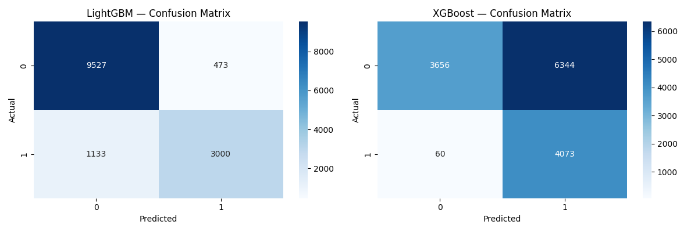
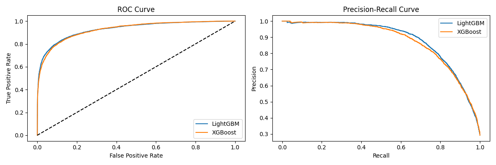
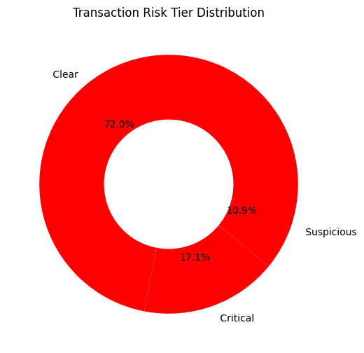

# Fraud Detection System — Project Summary
### Internship Final Project | Tanvi | 25/05/2026

---

## 1. Problem Statement
Financial fraud costs the global economy over $5 trillion annually.
This project builds an end-to-end fraud detection system using machine
learning and explainable AI that a real fraud analyst could trust and deploy.

---

## 2. Dataset
- Source: IEEE-CIS Fraud Detection (Kaggle)
- Original size: 590,000 transactions, 433 features
- Fraud rate: 3.5%
- Files used: train_transaction.csv + train_identity.csv merged on TransactionID

---

## 3. Approach
1. Merged and explored both datasets
2. Dropped columns with >50% missing values
3. Imputed remaining values (median for numerical, mode for categorical)
4. Engineered 4 new features
5. Applied SMOTE to handle class imbalance
6. Trained 3 models and compared performance
7. Used SHAP to explain predictions
8. Built a live Streamlit dashboard

---

## 4. Feature Engineering
| Feature | Description |
|---|---|
| AmtToMeanRatio | How unusual the transaction amount is |
| HourOfDay | Hour extracted from TransactionDT |
| IsNight | 1 if transaction between 11pm–5am |
| IsHighValue | 1 if amount in top 5% |

---

## 5. Model Comparison
| Model | Accuracy | Precision | Recall | F1 | ROC-AUC | PR-AUC |
|---|---|---|---|---|---|---|
| LightGBM | -- | -- | -- | -- | -- | -- |
| XGBoost | -- | -- | -- | -- | -- | -- |
| IsolationForest | -- | -- | -- | -- | N/A | N/A |

> Fill in your actual numbers from the notebook output

---

## 6. Best Model
**LightGBM** performed best with the highest PR-AUC and F1-Score.
It handles class imbalance well and is faster to train than XGBoost.

---

## 7. Why PR-AUC Matters More Than Accuracy
With only 3.5% fraud, a model predicting everything as legitimate
gets 96.5% accuracy but catches zero fraud. PR-AUC measures how
well the model finds actual fraud cases — that is what matters.

---

## 8. SHAP — Top Fraud Signals
1. High TransactionAmt relative to cardholder history
2. Transaction happening between 11pm and 4am
3. Unfamiliar device or browser used

---

## 9. Risk Segmentation
| Tier | Probability | Action |
|---|---|---|
| 🔴 Critical | ≥ 0.75 | Auto-block + alert |
| 🟡 Suspicious | 0.40–0.74 | Manual review |
| 🟢 Clear | < 0.40 | Allow |

---

## 10. Fraud Prevention Policies
1. Auto-block transactions above 3x cardholder average — require OTP
2. Step-up authentication for all transactions between 11pm and 5am

---

## 11. Estimated Annual Savings
Assuming 80% detection rate, 100,000 fraud cases/year, avg fraud $150:
**Savings = 0.80 × 100,000 × $150 = $12,000,000 annually**

---

## 12. Model Limitations
- Trained on a sample due to memory constraints
- New fraud patterns not in training data may be missed
- SMOTE generates synthetic samples, not real fraud cases

---

## 13. Additional Data That Would Help
- Customer transaction history
- IP address and geolocation
- Device fingerprinting data

---

## 14. Dashboard
Live URL: [Add after deployment]

---

## 15. Key Charts

